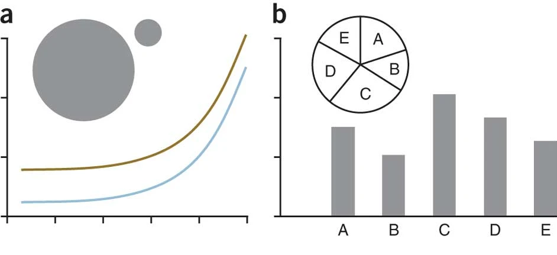

### why Nature?

[Nature](https://nature.com){:target="_blank"} publishes papers with clear figures, and we would like to mimic style of their figures following their guidelines.

Sources: [Nature Artwork Guide](https://www.nature.com/documents/natrev-artworkguide.pdf) [Final guide to authors](https://www.nature.com/documents/Final_guide_to_authors.pdf)


*Examples of Nature figures [(source)](https://www.nature.com/articles/nmeth0910-665){:target="_blank"}.*

### Python

Download `nature_plot_style.py` from [this GitHub repository](https://github.com/hoanglongcao/nature-plot-style){:target="_blank"} or directly [here](https://raw.githubusercontent.com/hoanglongcao/nature-plot-style/main/nature_plot_style.py){:target="_blank"}.

Place it in your folder, import the `set_nature_style()` function from the script, and apply it before plotting.



<script>
document.addEventListener('DOMContentLoaded', function() {
    const repoUrl = 'https://api.github.com/repos/hoanglongcao/nature-plot-style';  // Customize this URL as needed
    fetchGitHubRepoDetails(repoUrl);
});
</script>

<br>

```python
import nature_plot_style as nps  

# Apply Nature Journal style settings
nps.set_nature_style()

# Visualize the Nature-branded color palettes
nps.plot_color_palettes()

# Set width to inches for figure size
figwidth= 90 # 90mm or 180mm
ratio = 16/9
width_in_inches = figwidth / 25.4
height_in_inches = width_in_inches /ratio  # Maintain a aspect ratio
# To be used when create a plot: figsize=(width_in_inches, height_in_inches)

# Your plotting code here
```

### R *(coming soon)*
